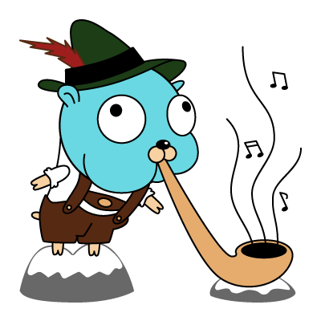

# GoSEPP

A go client for eyeson custom signaling protocol SEPP.



## Usage Call Interface

Create a new call by providing an WebRTC SDP, ensure to handle updates within
a callback provided to `SetSDPUpdateHandler`.

```go
package main

import (
	"context"
	"flag"
	"log"
	"time"

	"github.com/eyeson-team/gosepp/v2"
)

// main uses the signaling details of a eyeson meeting to initiate a webrtc
// connection. Find the proper credentials in a (JSON formatted) meeting
// response within the `.signaling.options` path.
func main() {
	authTokenFlag := flag.String("auth-token", "", "JWT token")
	clientIDFlag := flag.String("client-id", "", "Client-ID to use")
	confIDFlag := flag.String("conf-id", "", "Confserver-ID to connect to")
	flag.Parse()

	ci := &gosepp.CallInfo{
		SigEndpoint: gosepp.SeppEndpoint,
		AuthToken:   *authTokenFlag,
		ClientID:    *clientIDFlag,
		ConfID:      *confIDFlag,
	}

	call, err := gosepp.NewCall(ci)
	if err != nil {
		log.Fatalf("failed: %s", err)
	}
	defer call.Close()

	call.SetSDPUpdateHandler(func(sdp gosepp.Sdp) {
		log.Printf("Sdp update with type %s sdp: %s\n", sdp.SdpType, sdp.Sdp)
	})

	call.SetTerminatedHandler(func() {
		log.Println("Call terminated")
	})

	callID, sdp, err := call.Start(context.Background(),
		gosepp.Sdp{SdpType: "offer", Sdp: "dummy-sdp"}, "[Guest] Bla")
	if err != nil {
		log.Fatalf("Call failed with: %s", err)
	}

	log.Printf("Call with id %s and sdp %s", *callID, sdp.Sdp)

	time.Sleep(3 * time.Second)

	log.Println("Terminating call")
	if err = call.Terminate(context.Background()); err != nil {
		log.Printf("Termination failed: %s\n", err)
	}
}
```

## Usage Messaging Interface

The signaling connection provides state updates. The following snippet
demonstrates proper wait blocks to handle connection setup.

```go
package main

import (
  "log"
  "time"

	"github.com/eyeson-team/gosepp/v2"
)

func main() {
  clientID := "client-id"
  confID := "conf-id"
  sdp := "dummy-sdp"
  jwtToken := "signed-token"

  sepp, err := gosepp.NewGoSepp(gosepp.SeppEndpoint, jwtToken)
  if err != nil {
    log.Fatalf("failed: %s", err)
  }

	// wait for connected
  select {
  case connected, ok := <-sepp.ConnectStatusCh():
    if !ok || !connected {
      log.Fatalf("Failed to connect")
    }
  case <-time.After(2 * time.Second):
    log.Fatalf("Failed to connect")
  }

  if err := sepp.SendMsg(gosepp.MsgCallStart{
    MsgBase: gosepp.MsgBase{
      Type: gosepp.MsgTypeCallStart,
      From: clientID,
      To:   confID,
    },
    Data: gosepp.MsgCallStartData{
      Sdp:         gosepp.Sdp{SdpType: "offer", Sdp: sdp},
      DisplayName: clientID},
  }); err != nil {
    log.Fatalf("failed to send message:", err)
  }

  // wait for call accepted
  select {
  case msg, ok := <-sepp.RcvCh():
    if !ok {
      log.Fatalf("Failed to receive")
    }
    // dispatch messages
    switch m := msg.(type) {
    case *gosepp.MsgCallAccepted:
      log.Printf("Call Accepted: call-id: ", m.Data.CallID)
    default:
      log.Fatalf("Accept call failed")
    }
  case <-time.After(2 * time.Second):
    log.Fatalf("Waited too long for accept")
  }
}
```

## Development

```sh
$ go test
```
